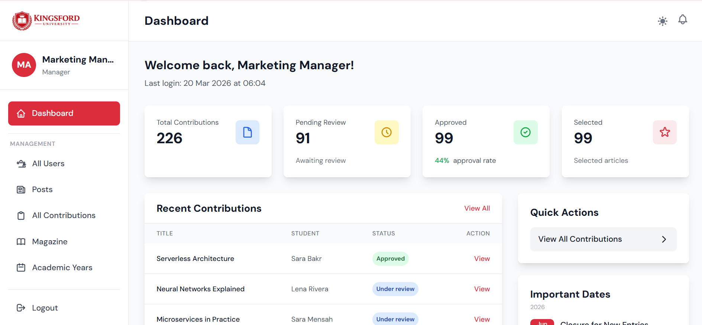
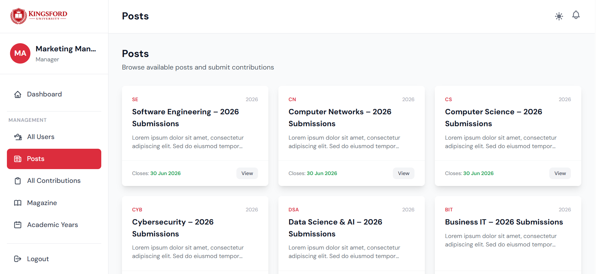
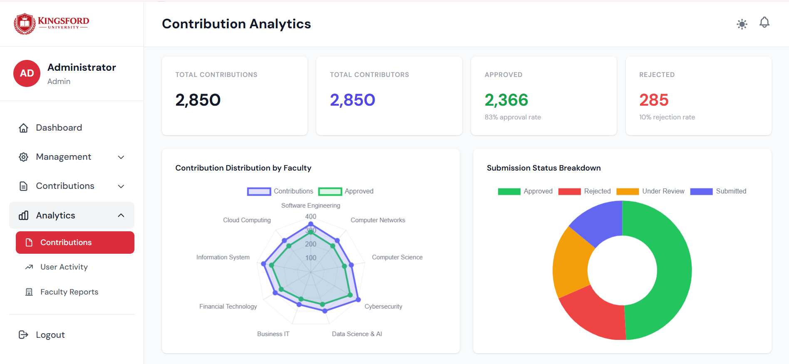
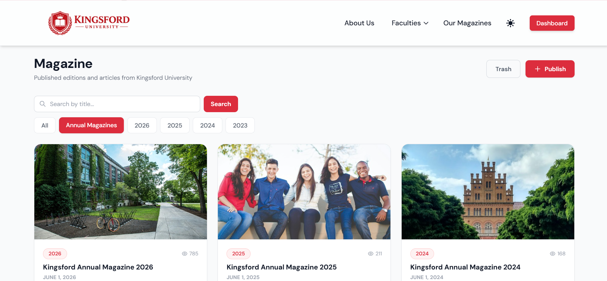

# Kingsford University Magazine Contribution Management System

<p align="center">
  
</p>

<p align="center">
  A secure, role-based web platform for managing student magazine contributions at Kingsford University — from submission to publication.
</p>

---

<p align="center">
  
  
  
  
  
  
</p>

---

## 📌 About the Project

The Kingsford University Magazine Contribution Management System is a full-stack web application developed to manage the end-to-end process of collecting, reviewing, and publishing student contributions for the university's annual magazine.

The system replaces manual and fragmented processes with a centralised, role-based platform where students submit articles and images, coordinators review and approve them, and the Marketing Manager compiles and publishes the final magazine — all within one secure system.

---

## 🖼️ Preview

### Home Page
<p align="center">
  
</p>

### Dashboard
<p align="center">
  
</p>

### Contribution Submission
<p align="center">
  
</p>

### Analytics
<p align="center">
  
</p>

### Magazine Publication
<p align="center">
  
</p>

---

## ✨ Features

### 👤 User & Access Management
- Student self-registration restricted to `@ksf.it.com` university email with email verification
- Coordinator and Manager accounts created by Admin with enforced first-login password change
- Guest accounts for faculty-specific public viewing
- Role-based access control across all system modules
- Last login timestamp displayed on every sign-in

### 📝 Contribution Submission
- Students submit Word documents and images to faculty-scoped contribution posts
- Terms & Conditions agreement required before submission
- Email and in-app notifications sent to coordinators on new submissions
- Coordinators comment, approve, or reject contributions
- Overdue submissions (no comment after 14 days) trigger automatic notifications
- Inappropriate content can be reported by students or coordinators for admin review

### 📖 Magazine Publication
- Marketing Manager downloads approved contributions as a ZIP file after final closure date
- Published magazines displayed on a public-facing magazine portal with view counts
- In-app notifications sent to all internal users on new publication

### 📊 Reports & Analytics
- Contribution analytics filtered by academic year with charts and faculty breakdown table
- Faculty reports with exception reports: contributions with no comment and overdue (14+ days)
- User activity report showing activity scores and last login per user
- System usage analytics: page views, active users, browser usage

### 🔔 In-App Notifications
- New contribution submitted
- Contribution commented on or approved
- Submission overdue for comment (14+ days)
- New report submitted / resolved by admin
- Guest account created
- Magazine published
- Contact request submitted / responded to
- Submission deadline approaching

### 🛡️ Security & Data Integrity
- Soft deletion across all major modules — no data is permanently lost
- Admin can view and restore deleted records
- Referential integrity enforced at database level

---

## 🛠️ Tech Stack

| Layer | Technology |
|---|---|
| Methodology | Agile Scrum |
| Backend Framework | [Laravel](https://laravel.com/)|
| Frontend Styling | [Tailwind CSS](https://tailwindcss.com/) |
| Frontend Interactivity | [Alpine.js](https://alpinejs.dev/) |
| Authentication | [Laravel Breeze](https://laravel.com/docs/starter-kits#laravel-breeze) |
| Role & Permissions | [Spatie Laravel Permissions](https://spatie.be/docs/laravel-permission) |
| Database | MySQL |
| File Storage | [Cloudflare R2](https://developers.cloudflare.com/r2/) (S3-compatible) |
| Hosting | [Laravel Cloud](https://cloud.laravel.com/) |
| Outgoing Email (Production) | [Brevo](https://www.brevo.com/) (SMTP) |
| Email Testing (Development) | [Mailtrap](https://mailtrap.io/) |
| Email Routing | [Cloudflare Email Routing](https://developers.cloudflare.com/email-routing/) |
| Charts & Graphs | [Chart.js](https://www.chartjs.org/) |
| Rich Text Editor | [Quill.js](https://quilljs.com/) |

---

## ⚙️ Installation

### Prerequisites
- PHP 8.2+
- Composer
- Node.js & NPM
- MySQL

### Setup

```bash
# Clone the repository
git clone https://github.com/BhoneMyatOo17/Kingsford-University-Magazine.git
cd Kingsford-University-Magazine

# Install PHP dependencies
composer install

# Install Node dependencies
npm install

# Copy environment file
cp .env.example .env

# Generate app key
php artisan key:generate

# Configure your database in .env, then run migrations and seeders
php artisan migrate --seed

# Build frontend assets
npm run dev

# Start the local server
php artisan serve
```

---

## 👥 User Roles

| Role | Access |
|---|---|
| **Admin** | Full system access, user management, academic year setup, analytics, soft-deleted records |
| **Marketing Manager** | View all approved contributions, download ZIP after final closure, publish magazines |
| **Marketing Coordinator** | View and manage contributions within their faculty, comment, approve/reject, manage guests |
| **Student** | Submit contributions to faculty posts, view own submissions, receive notifications |
| **Guest** | View approved contributions and faculty statistics for a specific faculty |

---

## 👨‍💻 Team

| Role | Name | Banner ID |
|---|---|---|
| Product Owner | Kyi Phyu Thant | 001512422 |
| SCRUM Master | Aye Myat Thiri Mon | 001510360 |
| UI/UX Designer | Yoon Thiri | 001512423 |
| Database Designer | Myat Shun Lei Zaw | 001512434 |
| Front-end Developer | Poe Waddy Khin Soe Lwin | 001510348 |
| Backend Developer | Bhone Myat Oo | 001510377 |
| Tester | Aye Thandar Aung | 001510299 |
| Tester | Min Thet Khine | 001510622 |

---

## 📄 License

This project is developed as an academic submission for **COMP1640 — Enterprise Web Software Development**.
